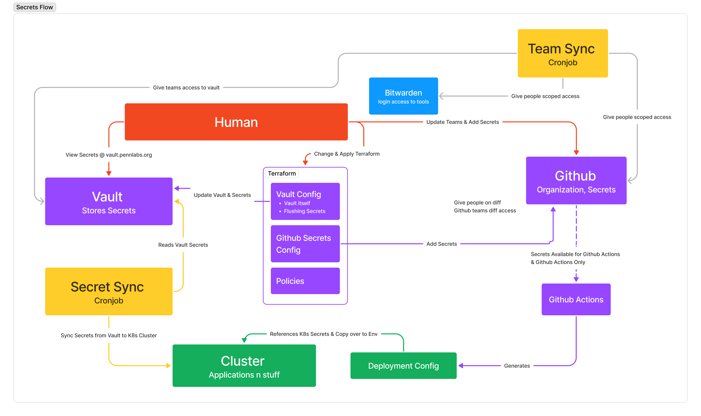

# Secrets
## Overview
Most of the Labs products reference **secrets** within their code.

Secrets are objects or values necessary for a product to function but should not be exposed to the public.

When it comes to configuring secrets, there are three parts we care about:

- **Location**: Where is the secret managed?
- **Access**: How do we access it?
- **Sync**: A secret got updated, what happens next?

> **Note**: When we talk about secrets, we are mainly referring to values necessary for the application. This does not include managing login information such as Bitwarden, which is still covered loosely here but not the focus.

# Location: Where is the secret managed?
At Labs, secrets and their values are managed in two places: [Vault](Vault.md) and [Github Secrets](Github.md).

The first, Vault, manages secrets that are referenced by each product as **container environment variable**.

The second, Github Secrets, manages secrets that are useful for our **CI/CD pipeline**.

There are other ways to store secrets, such as mounting them as files in containers. However, that method is not used in our infrastructure as our secrets mostly consist of name-value pairs.

### How are secrets added to Vault & Github?
Secrets and their values are added via the terraform modules specified in our [pennlabs/infrastructure](https://github.com/pennlabs/infrastructure) repo.

For more information on *what* types of secrets get added to Vault vs Github, see `Vault.md` and `Github.md`.

# Access

## Who needs access?

Read access:
  - Cluster
  - Github Actions

Read/write access
  - Human (e.g. Developers, DevOps)
  - Terraform: manages our infrastructure

## How do they get accessed?
### Cluster
To give the cluster gets access to secrets, we add them as container environment variables which can be referred to in code.

> **How do we scope secrets?** Deployments should scoped access to secrets, which is done by specifying a `secretRef` within the yaml pointing to the name of the secret object.

### Github Actions
Github Actions automatically have access to all secrets stored in the Github organization, with the exception of private repos (see [Github.md](Github.md))

### Developers
Humans can update secrets in 3 ways:
1. Change secret-related terraform & apply it (DevOps): in Vault, terraform only manages the database secrets; in Github, terraform only manages the main access keys
2. Update secrets on Vault
3. Add/remove secrets on Github

# Sync
## Secret-Sync
Once a secret got updated in one of the ways mentioned above, we have to make sure it gets propagated to the cluste.

For Vault, this is done through `secret-sync`, a cronjob that regularly reads vault and updates our cluster with the latest secret data.

## Team Sync
When a new lead gets added to a team via Github organization, they get access to **Vault**, **Bitwarden**, and **Django admin console** (if it applies).

TODO: Figure out how Team sync actually works

# Secrets Flow
